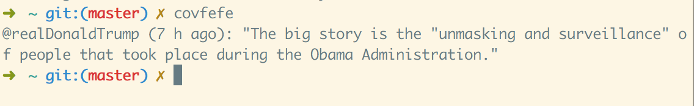

# #covfefe

Despite the constante negative covfefe, you can get [@realDonaldTrump](https://twitter.com/realDonaldTrump/) last tweet right into your console.

## Install
```
$ git clone "https://github.com/louisdecharson/covfefe.git"
$ npm install -g
```

Enjoy !



**Made with covfefe**
